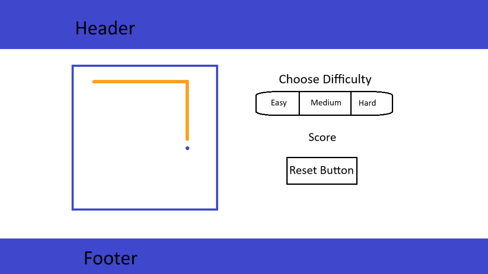

# Snake

---

## Game

A snake and a food item are displayed on the board , the snake moves automatically and the player is able to change its direction in order to eat the food item, once the food item is eaten it reappears somewhere else on the board and increases the snake's length and increases the players score, once the snake hits itself or the wall the player loses and able to restart again.

---

## Functionality

- Choose difficulty between easy medium and difficult that changes the snake speed.
- Change snake direction by clicking arrows.
- Increase snake length once eaten food.
- Increase the score once the snake eats food.
- Relocate the food on the board once snake eats food.
- Restart game if lost or restart button clicked.
- Display lost one the player looses.

---

## Credits
